# KinalApp - Sistema de Venta
KinalApp es una aplicación backend
desarrollada con Spring Boot y JPA/Hibernate 
para la gestión de ventas. Permite administrar clientes, usuarios, productos, 
ventas y detalles de venta, con una lógica de negocio que automatiza el cálculo de subtotales y totales.
## Características

- CRUD completo para Clientes, Usuarios, Productos, Ventas y DetalleVenta.
- Cálculo automático del subtotal de cada detalle (cantidad × precio unitario).
- Actualización automática del total de la venta al agregar, modificar o eliminar detalles.
- Validaciones básicas de datos.
- Arquitectura en capas (Controller, Service, Repository).

## Tecnologías utilizadas

- Java 17
- Spring Boot 3.x
- Spring Data JPA
- Hibernate
- MySQL / PostgreSQL (configurable)
- Maven

## Requisitos previos

- JDK 21 o superior
- Maven 3.6+
- MySQL (u otro gestor de base de datos)
- Git
- Postman (para probar los endpoints)

## Instalacion y Ejecucion 

1. Clonar repositorio 
2. Abrir Intellij IDEA.
3.  Abrir la carpeta que clono.
4. Abrir MySQL en su ordenador.
5. Ingresar a la instancia activa en MySQL.
6. Regresar a Intellij IDEA.
7. Dirigirse a la carpeta "src\main\java\com\eduardoemilio".
8. Dirirgirse a KinalAppApplication y ejecutar la aplicación.
9. Abrir la carpeta "resources/application.properties".
10. Verificar que puerto esta utilizando la aplicación.
11. Abrir el navegador y poner el puerto http://localhost:8080/clientes.

## EndPoints 
1. code = DPI
2. Cliente:
3. "/clientes": Esto nos lista los clientes y agrega el cliente.
4. "/activos/estado": Esto lista los clientes que están activos.
5. "/{code}": Esto busca el cliente mediante él id.
6. "/{code}": Esto elimina el cliente mediante él id.
7. "/{code}": Esto actualiza el cliente mediante él id.

Usuario:

1. "/Usuarios": Esto nos lista los usuarios y agrega el usuario.
2. "/activos/estado": Esto lista los usuarios que están activos.
3. "/{code}": Esto busca el usuario mediante él id.
4. "/{code}": Esto elimina el usuario mediante él id.
5. "/{code}": Esto actualiza el usuario mediante él id.

Producto:

1. "/productos": Esto nos lista los productos y agrega el producto.
2. "/activos/estado": Esto lista los productos que están activos.
3. "/{code}": Esto busca el producto mediante él id.
4. "/{code}": Esto elimina el producto mediante él id.
5. "/{code}": Esto actualiza el producto mediante él id.
6. "/stock": Esto lista el nombre del producto y la cantidad que hay en stock.

Venta:

1. "/ventas": Esto nos lista las ventas y agrega la venta.
2. "/activos/estado": Esto lista las ventas que están activos.
3. "/{code}": Esto busca la venta mediante él id.
4. "/{code}": Esto elimina la venta mediante él id.
5. "/{code}": Esto actualiza la venta mediante él id.

DetalleVenta:

1. "/detallesVentas": Esto nos lista los detalles de venta y agrega el detalle venta.
--
2. "/activos/estado": Esto lista los detalles de venta que están activos.
3. "/{code}": Esto busca los detalles de venta mediante él id.
4. "/{code}": Esto elimina los detalles de venta mediante él id.
5. "/{code}": Esto actualiza los detalles de venta mediante él id.

## Postman del Proyecto

- Post de Clientes
{
"DPICliente": "1234567890123",
"nombreCliente": "Juan",
"apellidoCliente": "Pérez",
"direccion": "Calle Falsa 123",
"estado": 1
}
---
- Post de Usuario
{
"username": "vendedor1",
"password": "123456",
"email": "vendedor@tienda.com",
"rol": "VENDEDOR",
"estado": 1
}
---
- Post de Producto
{
"nombreProducto": "Laptop Gamer",
"precio": 1500.00,
"stock": 10,
"estado": 1
}
---
- Post de Venta
{
"fechaVenta": "2025-03-27",
"total": 12.00,
"estado": 1,
"cliente": {
"DPICliente": "1234567890123",
"estado": 1
},
"usuario": {
"codigoUsuario": 1,
"estado": 1
}
}
---
- Post de DetalleVenta
{
"cantidad": 2,
"precioUnitario": 1850.00,
"subtotal": 3700.00,
"producto": {
"codigoProducto": 1,
"estado": 1,
"stock": 15
},
"venta": {
"codigoVenta": 1,
"estado": 1
}
}

## implementacion de tymelaft 
Se creó una estructura de carpetas organizada dentro de src/main/resources/templates/. 
Todas las vistas heredan de un layout base que contiene la barra de navegación


### vista de Autenticación/login:

- login.html - Formulario de inicio de sesión con campos de email y contraseña, más un enlace para registrar nueva cuenta.
---
- registro.html - Formulario para crear un nuevo usuario con username, email y password.
---
- menu.html - Página principal con tarjetas de acceso a cada módulo del sistema.

### vista de Usuarios:

- usuario/lista.html - Listado de usuarios con filtros por estado (activos/inactivos/todos).
---
- usuario/formulario.html - Formulario reutilizable para crear y editar usuarios.

### vista de Clientes:

- cliente/lista.html - Listado de clientes con filtros por estado. Muestra DPI, nombre, apellido, dirección y estado.
---
- cliente/formulario.html - Formulario para crear o editar clientes, con DPI como clave primaria.

### vista de Productos:

- producto/lista.html - Listado de productos con código, nombre, precio, stock y estado.
---
- producto/formulario.html - Formulario para gestionar productos.

### vista de Ventas:

- venta/lista.html - Listado de ventas (solo visualización, sin botones de editar/eliminar por cumplimiento fiscal).
---
- venta/formulario.html - Formulario exclusivo para crear nuevas ventas, con selección de cliente y usuario.
---
- venta/detalle.html - Vista detallada de una venta, mostrando todos los productos asociados y sus cantidades.

### vista de Detalles de Venta:

- detalle/lista.html - Listado de detalles de venta en modo solo lectura (sin acciones de modificación).
---
- detalle/formulario.html - Formulario para agregar nuevos detalles a una venta existente.

## Recursos estáticos y estilos
- Se agregó la carpeta src/main/resources/static/images/ para alojar el logo de la empresa (KS Solution's). También se incorporó una paleta de colores personalizada en el layout base, con los siguientes colores corporativos:
---
- Azul marino profundo (#1B365D) para la barra de navegación y encabezados.
---
- Azul real (#2A5DA0) para botones primarios y degradados.
---
- Naranja vibrante (#FF8C00) para detalles de énfasis y hover.
---
- Gris carbón (#333F48) para textos secundarios.
---
- Blanco nieve (#FFFFFF) para fondos y espacios negativos.

## Cambios de controller para poder implementar tymelaft

### LoginController (nuevo)
Se creó este controlador desde cero para manejar el inicia sesion y el registro.
---
- Creación del método mostrarLogin() que retorna la vista login.
---
- Creación del método procesarLogin() que recibe email y password, busca el usuario en la base de datos y guarda la sesión.
---
- Creación del método mostrarRegistro() que retorna la vista registro.
---
- Creación del método procesarRegistro() que guarda un nuevo usuario con rol "USER" y estado activo.
---
- Creación del método menu() que muestra el menú principal verificando sesión activa.
---
- Creación del método logout() que invalida la sesión y redirige al login.

### UsuarioController
- Modificación del método listar() para agregar usuarios al modelo y retornar "usuario/lista".
---
- Modificación del método nuevo() para agregar un nuevo objeto Usuario al modelo y retornar "usuario/formulario".
---
- Modificación del método guardar() para usar RedirectAttributes con mensajes flash.
---
- Modificación del método editar() para usar Optional con map() y orElseGet().
---
- Modificación del método actualizar() para recibir @PathVariable y @ModelAttribute.
---
- Modificación del método eliminar() para usar RedirectAttributes y redirigir.
---
- Modificación del método usuarioEstado() para filtrar por estado y retornar la misma vista con datos filtrados.

### ClienteController
- Modificación del método listar() para retornar "cliente/lista".
---
- Modificación del método nuevo() para retornar "cliente/formulario".
---
- Modificación del método guardar() para usar mensajes.
---
- Modificación del método editar() para buscar por DPI (String).
---
- Modificación del método actualizar() para recibir DPI como @PathVariable.
---
- Modificación del método eliminar() para eliminar por DPI.
---
- Modificación del método clienteEstado() para filtrar por estado.

### ProductoController
- Modificación de listarProducto() para retornar "producto/lista".
---
- Modificación de nuevo() para retornar "producto/formulario".
---
- Modificación de guardar(), editar(), actualizar(), eliminar() y productoEstado() siguiendo el mismo patrón.

### VentaController
- Modificación de listarVenta() para retornar "venta/lista".
---
- Modificación de nuevo() para:
---
- Crear una venta con fecha actual y estado activo por defecto.
---
- Agregar al modelo las listas de clientes y usuarios para los selectores del formulario.
---
- Retornar "venta/formulario".
---
- Modificación de guardar() para:
---
- Recibir clienteDpi y usuarioCode como parámetros separados (no vienen dentro del objeto Venta).
---
- Buscar y asignar el cliente y usuario antes de guardar.
---
- Calcular subtotales si es necesario.
---
- Creación del método ver() para mostrar el detalle completo de una venta.
---
- Eliminación de métodos editar(), actualizar() y eliminar() por razones fiscales (no se permiten modificaciones en ventas registradas).

### DetalleVentaController
- Modificación de listar() para retornar "detalle/lista".
---
- Modificación de nuevo() para:
---
- Crear un detalle con valores por defecto.
---
- Agregar al modelo las listas de ventas y productos.
--
- Retornar "detalle/formulario".
---
- Modificación de guardar() para:
---
- Recibir ventaId y productoId como parámetros separados.
---
- Buscar y asignar la venta y el producto.
---
- Calcular automáticamente el subtotal (cantidad × precioUnitario).
---
- Creación del método listarPorVenta() para filtrar detalles por ID de venta.
---
- Eliminación de métodos editar(), actualizar() y eliminar() por razones fiscales.

## Instrucciones de Uso de la Aplicacion
1. Ingrese en un buscador web "http://localhost:8090/login"
2. Abajo hay un url para registrar Usuario. 
3. Registra el Usuario con sus datos recomendados. 
4. ahora esta en el menu/dasboard. 
5. puede elegir que elemento trabajar. 
6. Listo ya ingresaste al sistema.


## Imagenes de funcionamiento de la aplicacion

### login/autenticacion 
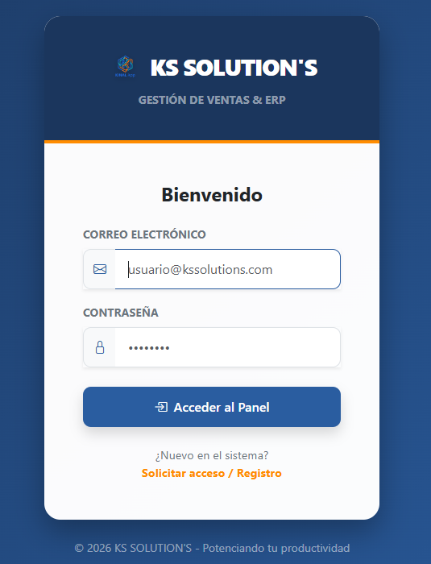
### Registro de Usuario
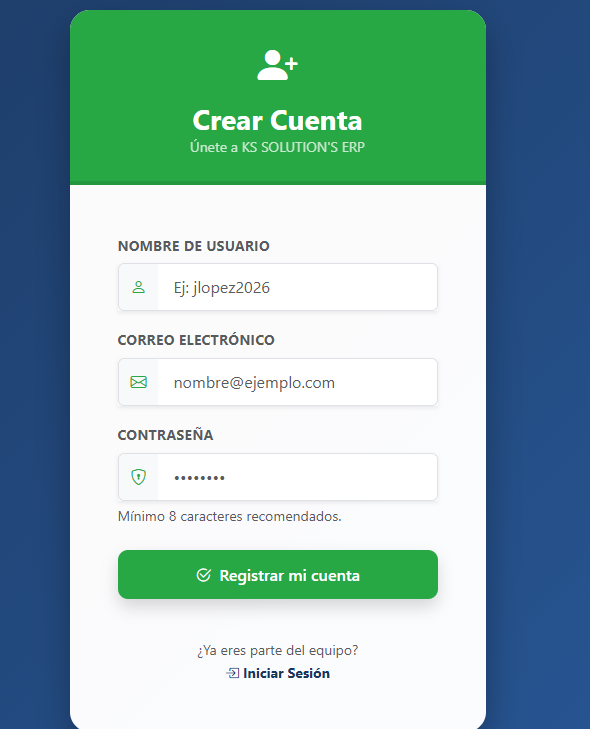

## Validaciones

### Caracter obligatorio en email
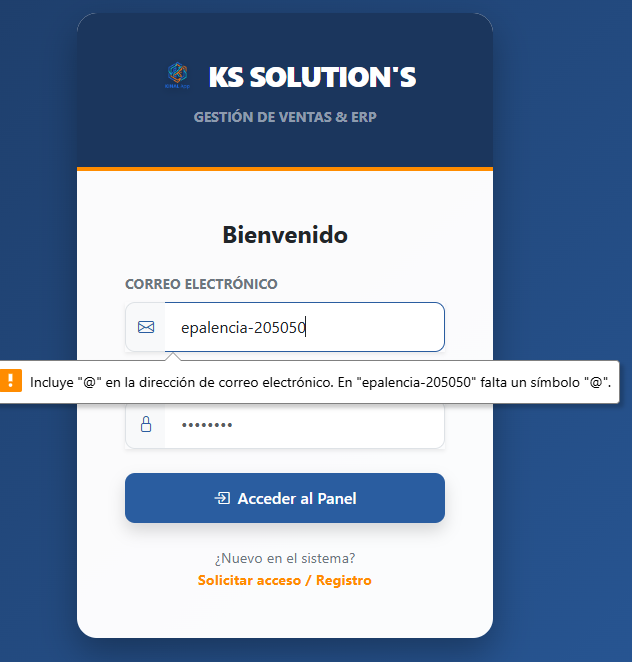
### Contrasenia valida
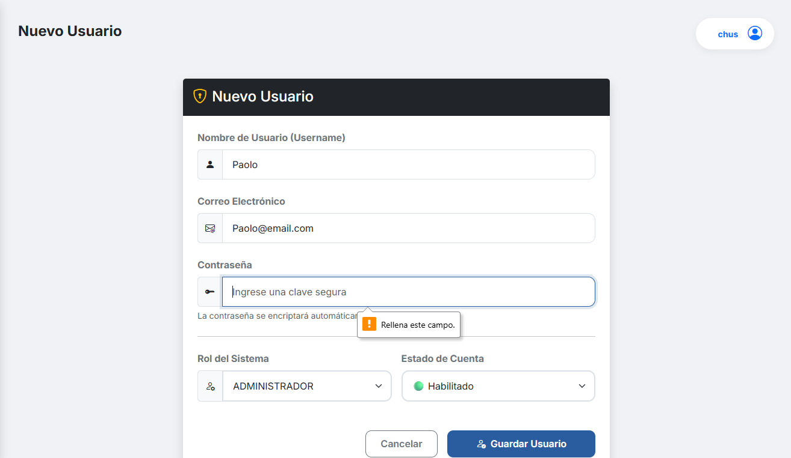
### Precio deve ser positivo 
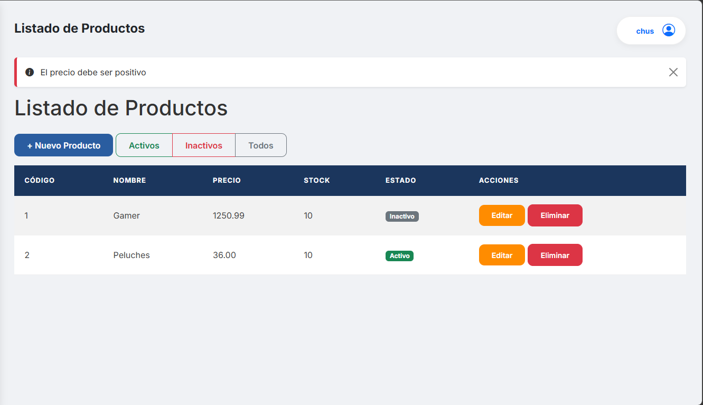


## Funcionamiento 

### Dasboard
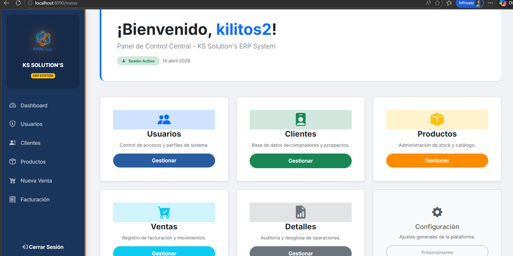
### Funcionamiento completo de Usuario
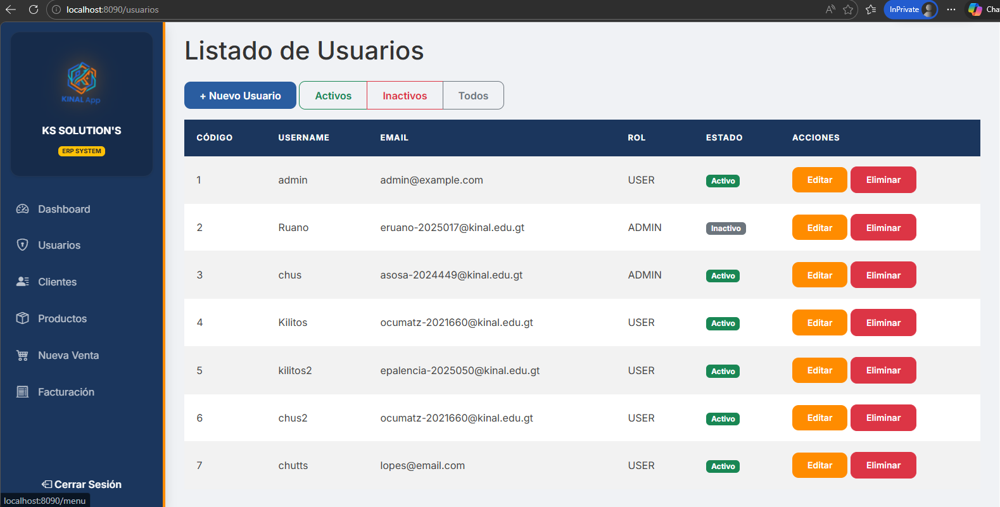
### Funcionamiento completo de CLiente
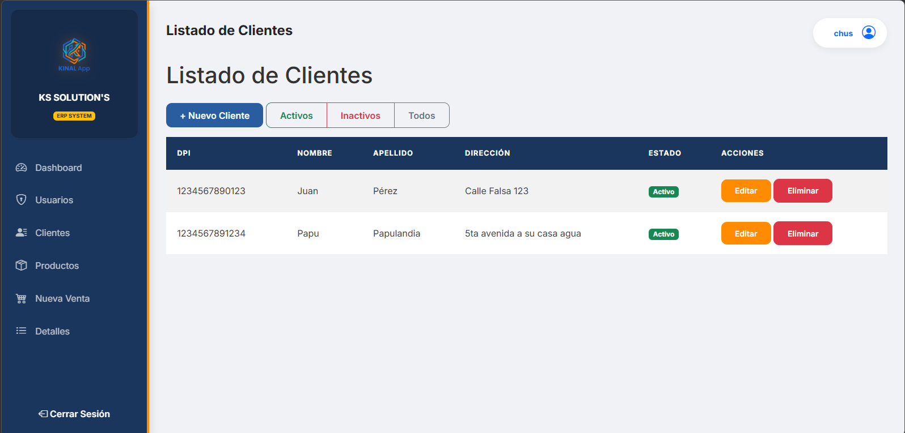
### Funcionamiento completo de Producto
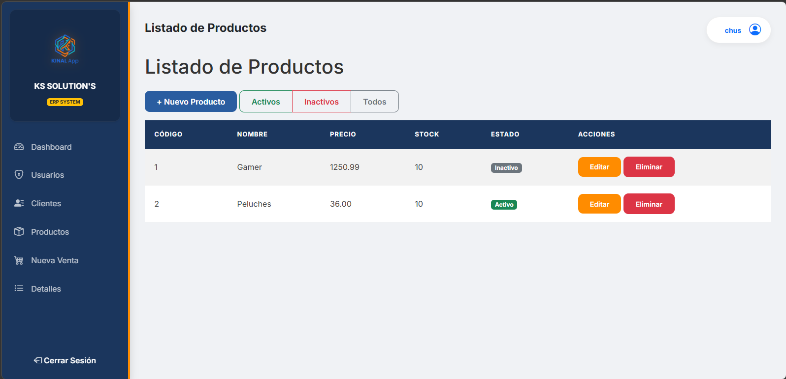
### Funcionamiento completo de Venta
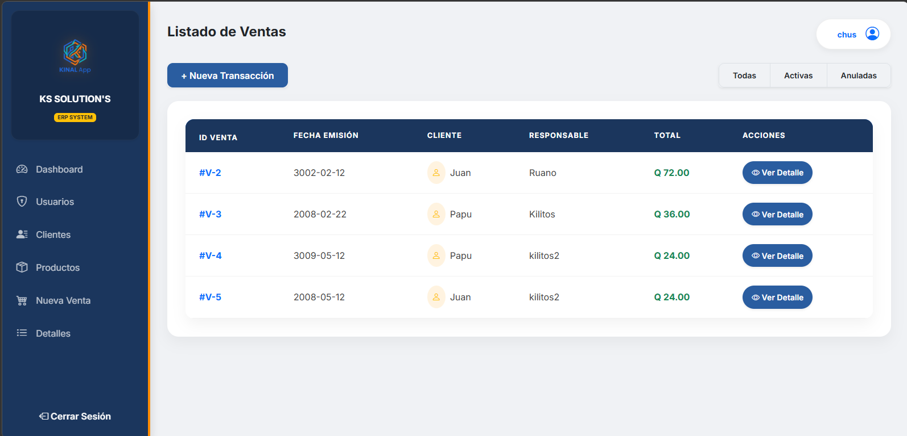
### Funcionamiento completo de DetalleVenta
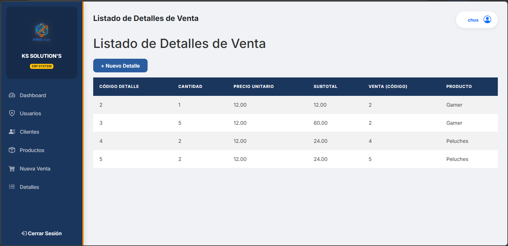
### Factura de compra 
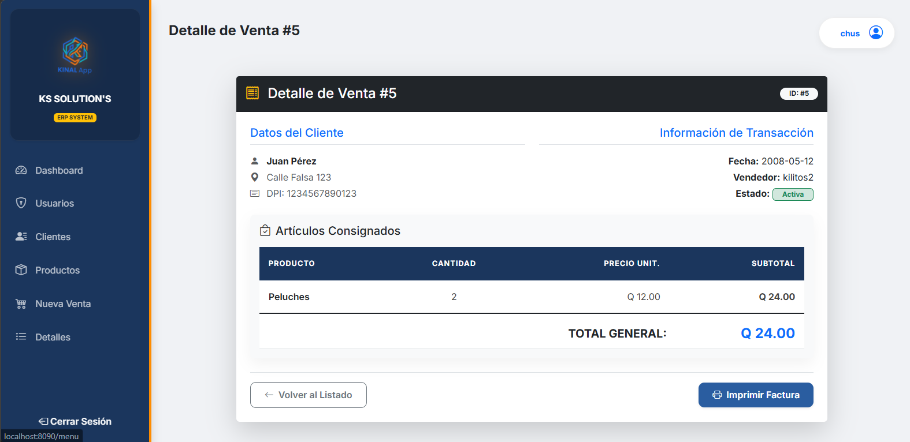
### Logo de la pagina 
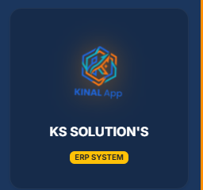


## Estructura del proyecto Kinal App
````
| Carpeta / Archivo | Descripción |
| ├── **src/main/java/com.eduardoemilio.KinalApp** | Código fuente principal |
| │
| │ ├── **controller** | Controladores REST/Web |
| │ │ ├── ClienteController.java | Controlador de clientes |
| │ │ ├── DetalleVentaController.java | Controlador de detalles de venta |
| │ │ ├── LoginController.java | Controlador de autenticación |
| │ │ ├── ProductoController.java | Controlador de productos |
| │ │ ├── UsuarioController.java | Controlador de usuarios |
| │ │ └── VentaController.java | Controlador de ventas |
| │ │
| │ ├── **entity** | Entidades JPA |
| │ │ ├── Cliente.java | Entidad Cliente |
| │ │ ├── DetalleVenta.java | Entidad DetalleVenta |
| │ │ ├── Producto.java | Entidad Producto |
| │ │ ├── Usuario.java | Entidad Usuario |
| │ │ └── Venta.java | Entidad Venta |
| │ │
| │ ├── **repository** | Repositorios JPA |
| │ │ ├── ClienteRepository.java | Repositorio de clientes |
| │ │ ├── DetalleVentaRepository.java | Repositorio de detalles de venta |
| │ │ ├── ProductoRepository.java | Repositorio de productos |
| │ │ ├── UsuarioRepository.java | Repositorio de usuarios |
| │ │ └── VentaRepository.java | Repositorio de ventas |
| │ │
| │ └── **service** | Capa de servicios |
| │     ├── IClienteService.java | Interface de ClienteService |
| │     ├── clienteService.java | Implementación de ClienteService |
| │     ├── IDetalleVentaService.java | Interface de DetalleVentaService |
| │     ├── DetalleVentaService.java | Implementación de DetalleVentaService |
| │     ├── IProductoService.java | Interface de ProductoService |
| │     ├── productoService.java | Implementación de ProductoService |
| │     ├── IUsuarioService.java | Interface de UsuarioService |
| │     ├── usuarioService.java | Implementación de UsuarioService |
| │     ├── IVentaService.java | Interface de VentaService |
| │     └── VentaService.java | Implementación de VentaService |
| │
| └── **src/main/resources** | Recursos de la aplicación |
|     ├── **static** | Recursos estáticos |
|     │   ├── css | Hojas de estilo |
|     │   └── images | Imágenes |
|     │
|     └── **templates** | Plantillas Thymeleaf |
|         ├── layouts/base.html | Plantilla base |
|         ├── login.html | Página de inicio de sesión |
|         ├── menu.html | Menú principal |
|         ├── registro.html | Registro de usuarios |
|         │
|         ├── Cliente/ | Vistas de clientes |
|         │   ├── formulario.html | Formulario de clientes |
|         │   └── lista.html | Listado de clientes |
|         │
|         ├── detalle/ | Vistas de detalles de venta |
|         │   ├── formulario.html | Formulario de detalles |
|         │   └── lista.html | Listado de detalles |
|         │
|         ├── Producto/ | Vistas de productos |
|         │   ├── formulario.html | Formulario de productos |
|         │   └── lista.html | Listado de productos |
|         │
|         ├── Usuario/ | Vistas de usuarios |
|         │   ├── formulario.html | Formulario de usuarios |
|         │   └── lista.html | Listado de usuarios |
|         │
|         └── Venta/ | Vistas de ventas |
|             ├── detalle.html | Detalle de venta |
|             ├── formulario.html | Formulario de ventas |
|             └── lista.html | Listado de ventas |
_____________________________________________________________________
````
